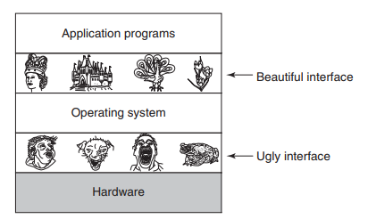

# Sistemas Operacionais

## O que é um sistema operacional?

Sistema operacional é uma **máquina estendida** e um **gerenciador de recursos**

- Máquina estendida: apesar do SO ser um software ele é uma extensão do hardware; estende os recursos da máquina
- Gerenciador de recursos: memória, I/O (entrada/saída), processos, arquivos

O gerenciamento de recursos inclui _multiplexing_ (compartilhar) recursos de duas maneiras: tempo e espaço.

O sistema operacional abstrai o hardware.

## História dos sistemas operacionais

O primeiro computador digital ("analytical engine") foi projetado pelo matemático inglês, Charles Babbage (1792 - 1871).

- Primeira geração (1945–55): Vacuum Tubes
- Segunda geração (1955–65): Transistors and Batch Systems
- Terceira geração (1965–1980): ICs and Multiprogramming
- Quarta geração (1980–Present): Personal Computers

---

Fonte:

- [Sistemas Operacionais - Aula 0 - Visão Geral, Conceitos Básicos de Sistemas Operacionais](https://www.youtube.com/watch?v=OmFr8blS5Ts&list=PLn9tst_548zU9utXG07-6jZ4zb57yJTtO&index=3&t=0s)
- Livro: Modern Operating Systems. 4 ed.
